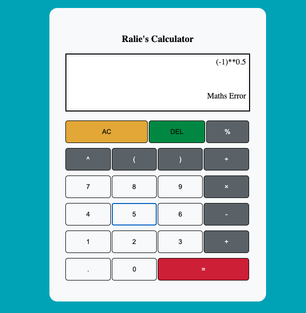

# Calculator
<h4> Build the project </h4>
<ul>
    <li>git clone https://github.com/ralietonle/Angular-calculator.git</li>
    <li><b>npm install</b> to install dependencies </li>
    <li><b>ng serve</b> to build and serve the app at localhost:4200 </li>
</ul>
<h4>... or run the demo </h4>
<ul>
    <li>Copy the calculator directory under dist directory</li>
    <li>Paste it to the sites directory of a server. Eg: In MAMP, paste it to htdocs.</li>
    <li>Run the app. Eg: In MAMP, go to localhost:8888/calculator </li>
</ul>
<h4> Demo </h4>

